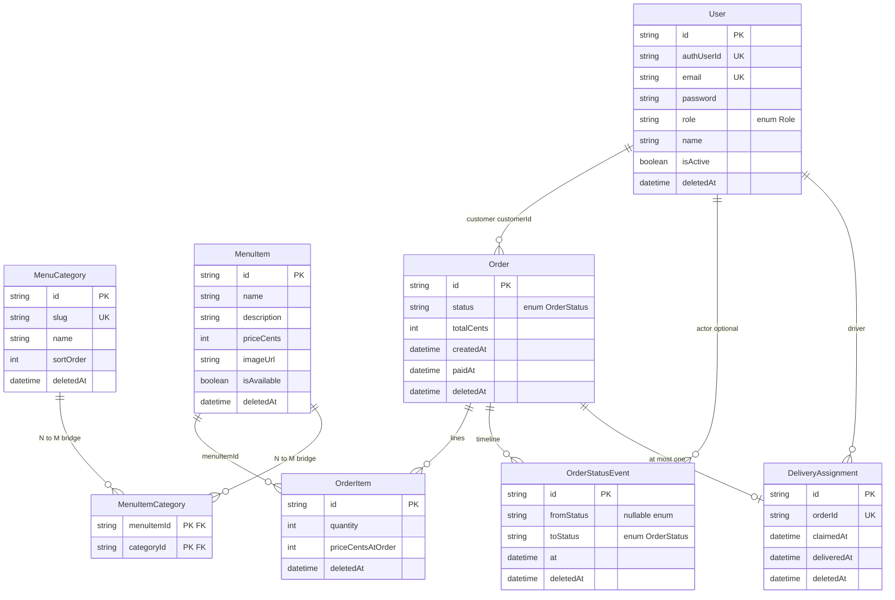

[](https://sdgpxydkqdthgolfmpei.supabase.co/storage/v1/object/public/website-assets/banner.jpg)

# mc-seanlibee — Food ordering MVP

Multi-role **Next.js 16** + **React 19** + **Tailwind 4** demo with **Prisma + PostgreSQL** (Supabase or local Postgres) and **mocked** Stripe, realtime, and storage integrations (`TODO(real-keys:…)` markers).

**Memorization / defense notes (short reads):** [docs/defense/](./docs/defense/) — project overview, user flows, architecture, data model, stack decisions, limitations.

---

## Overview

### Problem & goals

End-to-end **multi-role food ordering**: customer browse → **cookie-backed cart** → checkout → **`Order` in Postgres** → kitchen / driver / admin operations. Persisted catalog, orders, status history, and optional delivery assignment without requiring production payment or cloud auth on day one.

### Who it is for & non-goals

- **Audience:** demos, coursework, deployment rehearsal on Vercel + managed Postgres.

- **Not in scope yet:** production Stripe Checkout + webhooks, Supabase Auth as primary login, durable realtime/uploads — see **`docs/follow-up.md`** for the explicit swap list (`auth-mock-001`, `stripe-checkout-001`, etc.).

### Glossary

| Term | Meaning |
| --- | --- |
| **Server Action** | Server-only function callable from the UI (forms/RPC-style); replaces a separate JSON API for many flows here. |
| **Migration** | Versioned SQL from Prisma so every environment applies the same schema (`pnpm build` runs `prisma migrate deploy`). |
| **Soft delete** | Rows kept with `deletedAt` set; queries filter active rows (`prisma/schema.prisma`). |

---

## Architecture (high level)

Single Next.js **App Router** app: **`app/**/page.tsx`** + **Server Actions** in **`app/**/actions.ts`** → **`lib/*`** → **Prisma** (`lib/prisma.ts`) → **PostgreSQL**.

**No `app/**/route.ts` REST handlers** in this repo — integrations and mutations go through Server Actions unless you add routes later.

**Auth today:** **`mc_session`** signed cookie (`SESSION_SECRET`). Root **`middleware.ts`** verifies **`lib/auth/cookie`** on **`/customer`**, **`/kitchen`**, **`/driver`**, **`/admin`** and redirects unauthenticated users to **`/auth/login`**. **`@supabase/ssr`** exists for future bridging; **`lib/supabase/middleware.ts`** helper is separate from this gate (**code wins over stale codemap lines**).

**Payments today:** **`lib/payments/mock.ts`** — internal **`/dev/mock-stripe`** + **`simulateWebhook`** (no Stripe SDK in **`package.json`**).

```text
Browser → App Router pages → Server Actions → lib/ (auth, cart, pricing, payments, …) → Prisma → PostgreSQL
```

---

## Data model (summary)

Source of truth: **`prisma/schema.prisma`**.

- **`User`** — `Role` (`CUSTOMER` \| `KITCHEN` \| `DRIVER` \| `ADMIN`), email, scrypt-hashed password, optional **`authUserId`** for future external auth.
- **`MenuCategory`** / **`MenuItem`** / **`MenuItemCategory`** — menu with many-to-many item ↔ category links.
- **`Order`** / **`OrderItem`** — customer orders; line items store **`priceCentsAtOrder`**; status enum from **`PENDING_PAYMENT`** through fulfillment to **`DELIVERED`** or **`CANCELED`**.
- **`OrderStatusEvent`** — append-only style trail of status transitions (optional actor user).
- **`DeliveryAssignment`** — one driver claim per order (`orderId` unique).
- **`Archived*`** models — point-in-time snapshots (**no FKs** to live rows) for audit/recovery.

### Prisma ERD (live operational models)

Rendered from **`prisma/schema.prisma`** (Mermaid — works on GitHub). **Archive snapshot** tables (`ArchivedUser`, `ArchivedMenuItem`, …) are intentionally omitted here; they mirror the entities below **without FKs** to active rows.



**Cart before checkout** lives in **cookies** (`lib/cart-cookie`), not a `Cart` table. **RLS** is not defined in the Prisma schema; access is **app-layer** (middleware + **`requireRole`** / **`requireRoleLite`**). If your Supabase project adds DB policies, document them separately.

---

## Features & routes

| Area | Routes / notes |
| --- | --- |
| Public | **`/`** — landing; category/menu reads from Prisma |
| Auth | **`/auth/login`**, **`/auth/signup`** — signup creates **`Role.CUSTOMER`** only (`app/auth/actions.ts`) |
| Customer | **`/customer`**, **`/customer/items/[id]`**, **`/customer/cart`**, **`/customer/checkout`**, **`/customer/orders`**, **`/customer/orders/[id]`** |
| Kitchen | **`/kitchen`** |
| Driver | **`/driver`** |
| Admin | **`/admin`**, **`/admin/menu`**, **`/admin/users`**, **`/admin/audit`** |
| Dev | **`/dev/role-switcher`**, **`/dev/mock-stripe`**, **`/dev/multi-role`**, etc. (`README` previously listed) |

**Tests:** **`pnpm test`** (Vitest), **`pnpm test:e2e`** (Playwright).

---

## Tech stack & key decisions

| Layer | Choice |
| --- | --- |
| Framework | Next.js 16 App Router |
| UI | React 19, Tailwind 4 |
| Data | PostgreSQL + Prisma 6.19 |
| Auth (MVP) | App `User` rows + `mc_session` cookie |
| Integrations | Mock modules under `lib/payments`, `lib/realtime`, `lib/storage` |

**Decisions:** migrations in CI/build; Server Actions over a first HTTP API; cookie cart until order creation; mock boundaries with a single **`docs/follow-up.md`** checklist; **`OrderStatusEvent`** + archives for traceability. Prisma **`engineType = "binary"`** avoids a common Windows DLL lock issue in dev.

---

## Limitations & future work

MVP until real keys: see **`docs/follow-up.md`**. Notable gaps: production payments, Supabase Auth handoff, realtime/storage backed by Supabase, optional public API for mobile. Some **`docs/CODEMAPS/*`** middleware wording may not match **`middleware.ts`** — trust the code.

Regulatory claims (e.g. “GDPR”) require process and policy work beyond having archive tables.

---

## Quickstart

```bash
pnpm install
cp .env.example .env
# Set DATABASE_URL and DIRECT_URL to your Postgres instance (see below).
pnpm prisma migrate deploy
pnpm db:seed
pnpm dev
```

**Useful URLs**

- `/` — landing hub  
- `/dev/role-switcher` — legacy mock personas (kept for dev only)  
- `/dev/mock-stripe` — completes mock payments (`payments.simulateWebhook`)  
- `/dev/multi-role` — four-pane iframe lab (`credentialless`, Chromium)  
- `/customer`, `/kitchen`, `/driver`, `/admin` — gated route groups  

See `docs/follow-up.md` for every real-key wiring task and `docs/adr/0001-stack.md` for stack rationale. Migration baseline rationale: `docs/adr/0002-postgresql-migration-baseline.md`.

**Architecture documentation:** Start with `docs/CODEMAPS/INDEX.md` for a complete system overview, then dive into:

- **[Frontend](./docs/CODEMAPS/FRONTEND.md)** — Next.js pages, components, routing
- **[Backend & API](./docs/CODEMAPS/BACKEND.md)** — Server actions, session management, middleware
- **[Database](./docs/CODEMAPS/DATABASE.md)** — Prisma schema, migrations, indexing strategy
- **[Auth & RBAC](./docs/CODEMAPS/AUTH.md)** — Authentication flows, role-based access control
- **[Integrations](./docs/CODEMAPS/INTEGRATIONS.md)** — Mocked Stripe, Supabase, Realtime, Storage
- **[Utils & Helpers](./docs/CODEMAPS/UTILS.md)** — Shared utilities, validators, business logic

## Scripts

| Script | Purpose |
| --- | --- |
| `pnpm dev` | Next dev server |
| `pnpm build` | `prisma migrate deploy` + `prisma generate` + `next build` |
| `pnpm lint` / `pnpm typecheck` | Static checks |
| `pnpm test` | Vitest unit tests |
| `pnpm db:migrate` | `prisma migrate dev` |
| `pnpm db:seed` | Seed demo catalog + users (idempotent upserts where applicable) |
| `pnpm test:e2e` | Playwright fleet (auto-starts web server locally; needs `DATABASE_URL`) |

## Performance

The `/customer`, `/kitchen`, `/driver`, and `/admin` routes use `select`-shaped Prisma queries and run independent reads in `Promise.all`. Hot-path indexes live in `prisma/schema.prisma` (`Order(status, createdAt)`, `Order(customerId, createdAt)`, `OrderItem(orderId)`, `OrderItem(menuItemId)`, `MenuItem(isAvailable, name)`, `DeliveryAssignment(driverId)`).

Auth uses an app-signed `mc_session` cookie and verifies credentials against Prisma `User` (scrypt-hashed passwords). `User.authUserId` is app-managed and can be backfilled locally.

See `docs/perf/baseline.md` for the measurement protocol.

## Deploy notes (Vercel + Supabase)

### Environment variables

| Variable | Purpose |
| -------- | ------- |
| `DATABASE_URL` | Pooled Supabase URL (e.g. `?pgbouncer=true&connection_limit=1`) for serverless runtime |
| `DIRECT_URL` | Direct Postgres URL for migrations / introspection (`datasource.directUrl`) |
| `SESSION_SECRET` | Secret used to sign and verify app auth cookie (`mc_session`) |

Optional (local/e2e only):

| Variable | Purpose |
| -------- | ------- |
| `SEED_AUTH_PASSWORD` | Password used when creating seeded users (`Demo123!` fallback if unset) |
| `E2E_AUTH_PASSWORD` | Password used by e2e provisioned users (defaults to a hardcoded dev-only value if unset) |

### Build and database

1. `pnpm build` runs **`prisma migrate deploy`** before `next build`, so Vercel applies migrations when `DATABASE_URL` / `DIRECT_URL` are configured for the project.
2. **Seed** is not part of the build. After the first deploy, run once (locally against prod URLs, `vercel env pull`, GitHub Action with secrets, or Supabase SQL) — `pnpm db:seed` with remote env — so demo users and catalog exist.
3. Replace mocks under `lib/auth`, `lib/payments`, `lib/realtime`, and `lib/storage` per `docs/follow-up.md` when moving beyond the MVP.

### Seeded role accounts (admin/kitchen/driver)

Seeding creates app users in Postgres (`User`) with role + email + hashed password.

If you have existing users with null `authUserId`, run:

```bash
pnpm db:backfill:auth-user-id
```

The backfill is idempotent: it only links rows with null `authUserId` and safely skips conflicts.

### README banner asset

Banner image URL (public Supabase Storage object used for this repo’s hero/banner):

`https://sdgpxydkqdthgolfmpei.supabase.co/storage/v1/object/public/website-assets/banner.jpg`

---

Bootstrapped from [`create-next-app`](https://nextjs.org/docs/app/api-reference/cli/create-next-app); consult `node_modules/next/dist/docs/` when Next.js APIs diverge from older releases.
