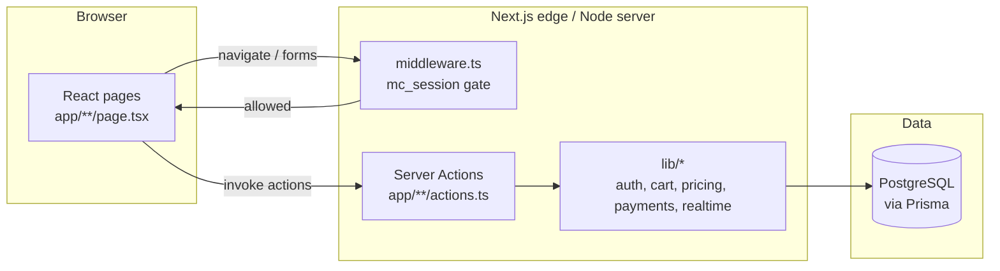

# Architecture

**Audience:** Mixed technical panel.

---

## One-paragraph shape

Single **Next.js App Router** application. UI pages in `app/` call **Server Actions** in colocated `actions.ts` files. Actions enforce **role checks** (`lib/auth` `requireRole` / `requireRoleLite`), run business helpers in `lib/`, and read/write **PostgreSQL** through **Prisma** (`lib/prisma.ts`). There is **no separate REST API** under `app/**/route.ts` in this repository (search shows zero `route.ts` files). External concerns (payments, realtime, storage) use **interface + mock** implementations today (`docs/follow-up.md`).

## Mermaid — request / data flow

## Client vs server

- **Server components & actions:** Default pattern for protected flows; mutations are server-side (`docs/CODEMAPS/architecture.md`).
- **Cart state:** Held in an HTTP cookie via `lib/cart-cookie` (not Postgres) until checkout creates an `Order` — keeps pre-order state lightweight and matches `app/(customer)/customer/actions.ts` imports.

## Auth (evidence-based)

- **Session transport:** Signed cookie `mc_session` (`middleware.ts` constant `SESSION_COOKIE`, `README.md`).
- **Edge gate:** Root `middleware.ts` verifies cookie with `verifySession` from `lib/auth/cookie` and redirects unauthenticated users on `/customer`, `/kitchen`, `/driver`, `/admin` prefixes to `/auth/login?next=…`.
- **Per-action / per-page RBAC:** `requireRole(Role.*)` and `requireRoleLite` in server actions and layouts redirect wrong roles to login with `denied=1` when applicable (`lib/auth/index.ts`).
- **User store:** Credentials and profile on Prisma `User`; optional `authUserId` column for future Supabase Auth linkage (`prisma/schema.prisma`, `docs/follow-up.md`).

**Note:** Repo also contains `lib/supabase/middleware.ts` (SSR client factory) and `@supabase/ssr` in `package.json`, but **root `middleware.ts` does not import it** — future Supabase session bridge, not the current gate.

## Payments (evidence-based)

- **Not production Stripe:** Mock module creates an internal redirect URL to `/dev/mock-stripe` and applies `simulateWebhook` transitions (`lib/payments/mock.ts`).
- **On success:** Order moves from `PENDING_PAYMENT` to `RECEIVED`, `paidAt` set, `OrderStatusEvent` row created, realtime publish fired (`lib/payments/mock.ts`).

## Realtime / storage (evidence-based)

- **Realtime:** Abstraction under `lib/realtime` with mock/in-process behavior; production swap documented in `docs/follow-up.md` (`docs/CODEMAPS/INTEGRATIONS.md`).
- **Storage:** Mock/fake URLs pattern under `lib/storage` per integrator doc — not re-derived here.

## SSR note

Pages are server-rendered by default in the App Router; no claim is made here about every leaf component’s client boundaries — see `docs/CODEMAPS/FRONTEND.md` for UI structure.

## Build / deploy hook

`pnpm build` runs `prisma migrate deploy` before `next build` (`package.json`) so database schema is applied in CI/hosting when env vars are present.
