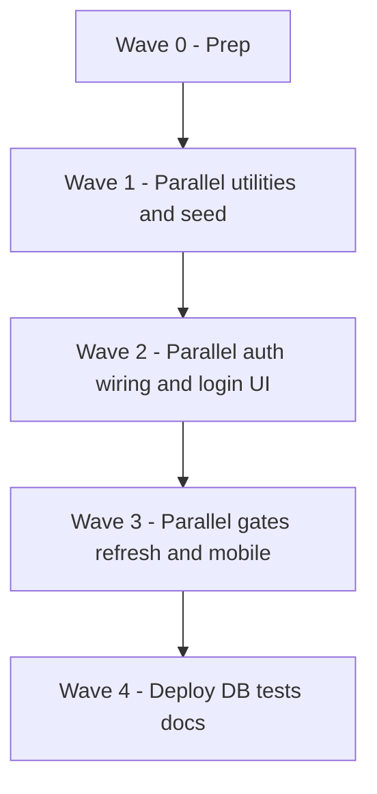

# Login, role redirect, live realtime UX, and mobile — unified implementation plan

> **For agentic workers:** Steps use checkbox (`- [ ]`) syntax. This file is the **single source of truth** for delivery. It combines [docs/superpowers/specs/2026-05-05-login-role-redirect-design.md](../specs/2026-05-05-login-role-redirect-design.md) (auth, redirects, Vercel/Supabase) with **live-demo realtime** (cross-device updates) and **phone-first layout** work.  
> **ECC / Cursor:** Use [`.cursor/skills/tdd-workflow/SKILL.md`](../../.cursor/skills/tdd-workflow/SKILL.md) and code review after edits. This repo has no `superpowers:subagent-driven-development` tool — use **parallel Task agents** or human developers on the lanes below.

**Goal:** One login path with demo users and role-based redirects; dashboards stay visually current during a **multi-device** live demo; UI is **mobile-responsive**; production can run on **Vercel + Supabase Postgres** with env-gated demo auth.

**Architecture:** Keep the signed `mc_session` cookie; add **gated** email/password demo sign-in (`DEMO_AUTH_ENABLED` / `DEMO_AUTH_PASSWORD`) with **constant-time** password check. Unauthenticated users hit `/login?next=...`. **Realtime:** In-process `EventEmitter` and `BroadcastChannel` do not span other phones or all Vercel instances — add **client `router.refresh()` polling** (with optional visibility throttling) on role queue pages; **optionally** add Supabase Realtime subscriptions later when keys exist. **Mobile:** Responsive stacks, touch targets, no horizontal overflow on login and role shells.

**Tech Stack:** Next.js (App Router), Prisma, SQLite locally / Postgres on Supabase for deploy, existing UI primitives under `components/ui/`.

---

## Related documents (reference only — requirements live here + spec)

| Doc | Role |
|-----|------|
| [2026-05-05-login-role-redirect-design.md](../specs/2026-05-05-login-role-redirect-design.md) | Product/security requirements, persona table, env vars |

---

## File map (expected ownership)

| Area | Files / dirs |
|------|----------------|
| Demo auth | [lib/auth/mock.ts](../../lib/auth/mock.ts), [lib/auth/index.ts](../../lib/auth/index.ts), new helpers under `lib/auth/` |
| Cookie | [lib/auth/cookie.ts](../../lib/auth/cookie.ts) (Secure flag behavior) |
| Gate | [middleware.ts](../../middleware.ts) |
| Login UI | `app/login/page.tsx`, server actions e.g. `app/login/actions.ts` |
| Seed | [prisma/seed.ts](../../prisma/seed.ts) |
| Live refresh | New `components/live-router-refresh.tsx` (or similar); mount in role route segments |
| Realtime future | [lib/realtime/mock.ts](../../lib/realtime/mock.ts), [docs/follow-up.md](../../follow-up.md) |

---

## Parallel execution model

Work is grouped into **waves**. Inside a wave, **lanes** are disjoint enough for **multiple agents in parallel** (different primary files). Finish a wave before starting the next unless a lane explicitly states **no dependency**.

---

### Wave 0 — Prep (1 assignee, quick)

- [ ] **W0.1** Confirm env names with spec: `DEMO_AUTH_ENABLED`, `DEMO_AUTH_PASSWORD`, `SESSION_SECRET`, `DATABASE_URL`.
- [ ] **W0.2** Create a working branch; agree merge order: Wave 1 → 2 → 3 → 4.

---

### Wave 1 — Parallel lanes (run simultaneously)

**Lane A — Pure auth helpers + tests (no cookie mutation yet)**  
*Agent A — files: `lib/auth/*` new modules only, `tests` or `*.test.ts`*

- [ ] **W1.A1** Add `lib/auth/demo-password.ts` (or similar): constant-time compare against `DEMO_AUTH_PASSWORD`; unit tests (wrong length, mismatch, match).
- [ ] **W1.A2** Add `lib/auth/safe-next-path.ts`: accept `next` query; allow only same-origin relative paths (starts with `/`, reject `//`, protocols); unit tests.

**Lane B — Seed personas**  
*Agent B — files: `prisma/seed.ts` only (coordinate if migration needed)*

- [ ] **W1.B1** Replace generic users with **Sean** (customer index 0), **Ginalyn** (customer index 1), **Christian** (kitchen), **Sherwin** (driver), **Marvin** (admin); emails per spec.
- [ ] **W1.B2** Preserve seeded orders that reference `customers[0]` / `customers[1]`; remove or repoint extras only if tests updated in same PR.
- [ ] **W1.B3** Run `pnpm db:seed` locally and verify counts.

**Lane C — Live refresh component (no page wiring)**  
*Agent C — files: `components/live-router-refresh.tsx`, optional test*

- [ ] **W1.C1** Client component: `useEffect` + `useRouter().refresh()` on interval (default 2500–3000 ms); cleanup on unmount.
- [ ] **W1.C2** When `document.visibilityState === 'hidden'`, increase interval or pause (optional but good for phones).
- [ ] **W1.C3** Export props: `intervalMs?: number`, `enabled?: boolean`.

---

### Wave 2 — Parallel lanes (run simultaneously after Wave 1 merged)

**Lane D — Session + demo sign-in implementation**  
*Agent D — files: `lib/auth/mock.ts`, `lib/auth/cookie.ts`, wire imports from Lane A*

- [ ] **W2.D1** Add `signInUser(user)` (name as fits codebase): builds payload, signs cookie, sets **`secure: NODE_ENV === 'production'`**.
- [ ] **W2.D2** Add `demoSignIn(email, password)` (or server action helper): if `NODE_ENV !== 'production'` **OR** `DEMO_AUTH_ENABLED === 'true'`, validate password via Lane A helper; load user by email; reject generically if missing/wrong.
- [ ] **W2.D3** Keep `devSignInAs` for dev tools but ensure middleware never sends retail users to role-switcher by default.
- [ ] **W2.D4** Integration-style test or route test if present in repo.

**Lane E — Login route + actions**  
*Agent E — files: `app/login/*`, depends on **exports** from Lane D (rebase if D lands second)*

- [ ] **W2.E1** `app/login/page.tsx`: email, password, submit; show generic error; collapsible “Demo accounts” table from spec.
- [ ] **W2.E2** Server action: call `demoSignIn`; redirect using Lane A `safeNextPath` + role default homes from spec §4.
- [ ] **W2.E3** Mobile: `max-w-md mx-auto`, `px-4`, `min-h-dvh`, primary button full width, min touch target 44px.

---

### Wave 3 — Parallel lanes (run simultaneously after Wave 2 merged)

**Lane F — Middleware + requireRole**  
*Agent F — files: `middleware.ts`, `lib/auth/index.ts`*

- [ ] **W3.F1** Unauthenticated access to protected prefixes → `/login?next=...` (replace `/dev/role-switcher`).
- [ ] **W3.F2** Allow `/login` through matcher without session.
- [ ] **W3.F3** `requireRole`: redirect to `/login` instead of role-switcher.

**Lane G — Mount live refresh on role dashboards**  
*Agent G — files: role `page.tsx` / layouts under `app/(customer)`, `app/(kitchen)`, `app/(driver)`; optional admin lists*

- [ ] **W3.G1** Import `LiveRouterRefresh` into kitchen home, driver home, customer orders/list surfaces where queue state changes (same pattern as [components/order-tracker.tsx](../../components/order-tracker.tsx) intent but list-level).
- [ ] **W3.G2** Do not duplicate `OrderTracker` on order detail — keep existing order detail behavior; ensure list pages refresh for multi-phone demo.

**Lane H — Mobile polish pass**  
*Agent H — files: `app/(kitchen)/kitchen/page.tsx`, `app/(driver)/driver/page.tsx`, `app/(customer)/customer/**/*.tsx`, shared layout*

- [ ] **W3.H1** Audit grids/cards for overflow at 375px; adjust `gap`, `flex-wrap`, heading sizes.
- [ ] **W3.H2** Add `touch-manipulation` or equivalent on frequent actions if buttons feel sluggish on iOS.

---

### Wave 4 — Deploy, DB, tests, docs (parallel where marked)

**Lane I — Postgres / Supabase path**  
*Agent I*

- [ ] **W4.I1** Document or implement `provider = "postgresql"` for production; connection pooler URL note for Vercel.
- [ ] **W4.I2** Migrations; `prisma migrate deploy` in CI/Vercel build step if not already.
- [ ] **W4.I3** No secrets in repo; checklist for dashboard-only keys.

**Lane J — QA & E2E**  
*Agent J*

- [ ] **W4.J1** E2E: unauthenticated `/customer` → `/login?next=...` → Sean → `/customer`.
- [ ] **W4.J2** E2E or manual script: each role lands on correct home; Ginalyn customer works.
- [ ] **W4.J3** Smoke on real phone or DevTools 375px.

**Lane K — Docs single pointer**  
*Agent K*

- [ ] **W4.K1** README or `docs/` section: one table linking **this plan** + spec + demo credentials + env vars.
- [ ] **W4.K2** Optional Supabase Realtime follow-up: pointer to [docs/follow-up.md](../../follow-up.md) — do not duplicate two plans.

**Lane L — Optional Supabase Realtime (only if keys available)**  
*Agent L — parallel with I/J/K if staff available; otherwise defer*

- [ ] **W4.L1** When `NEXT_PUBLIC_SUPABASE_URL` + anon key set, subscribe to `Order` changes and call `router.refresh()`; fallback to Lane C polling if unset.

---

## Merge conflict avoidance

| Wave | Rule |
|------|------|
| 1 | A/B/C touch disjoint paths — safe parallel. |
| 2 | **D before E** if E imports incomplete APIs — or **E stubs** then D fills. Prefer landing **D** first. |
| 3 | F vs G vs H: **F** touches middleware/auth index; **G** touches app routes; **H** touches same routes as G — **coordinate G/H** (same PR or sequential H after G). |
| 4 | Independent. |

---

## Spec + requirements traceability

| Requirement | Where in plan |
|-------------|----------------|
| Spec §1–5 Login, redirects, personas | W1.B, W2.D–E, W3.F |
| Spec §6–7 Demo auth, cookies, Vercel/Supabase | W2.D, W4.I |
| Live demo “realtime” (cross-device) | W1.C, W3.G, W4.L |
| Mobile-responsive demo | W2.E3, W3.H |
| Testing | W1.A tests, W4.J |

---

## Self-review (plan quality)

- [x] Single plan file; no second parallel plan document required.
- [x] Parallel lanes named; file ownership explicit; merge rules for G/H.
- [x] Supabase Realtime optional — polling baseline satisfies live demo.

---

**Execution handoff (ECC default):** After review, implement wave-by-wave; use **parallel agents** for lanes in the same wave. Prefer small commits per lane.
