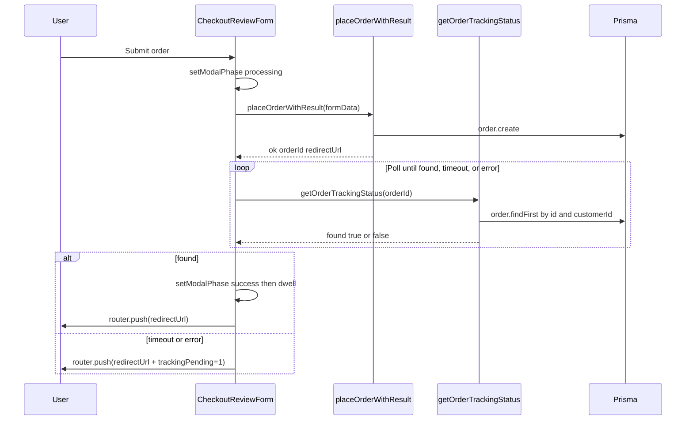

# Checkout payment success gated on real order tracking

**Status:** Approved for implementation
**Date:** 2026-05-08
**Scope:** Replace the artificial success-dwell timer in the checkout flow with a real wait keyed off order-tracking visibility, and surface a deterministic timeout fallback.

---

## 1. Goals

1. The payment status modal stays in the `processing` state with the spinner visible from the moment the customer submits the order until the placed order is reflected on order tracking, with no artificial random dwell.
2. The modal transitions to `success` (and then redirects to the order tracking page) **only** after a server-side check confirms the order exists and belongs to the current user.
3. A bounded, deterministic timeout protects against an infinite spinner. On timeout (or polling error) the customer is still routed to the existing redirect URL, but with a `trackingPending=1` query flag so the order page can hint that tracking propagation is in progress. No fake success state is ever shown.
4. Existing modal behaviors are preserved: focus trap, body-scroll lock, `aria-live` announcements, `prefers-reduced-motion` (no `animate-spin`), and the existing prop API (`phase: "processing" | "success" | null`).

## 2. Non-goals

- Realtime / websockets / Server-Sent Events. v1 uses HTTP polling only.
- Visual redesign of the modal or the form.
- New dependencies (no `react-query`, no `swr`, no state-machine library).
- Tracking statuses beyond order existence (e.g., `PREPARING`, `READY`). The order is created synchronously today with `OrderStatus.RECEIVED`; the gate intentionally checks existence only, so the architecture is robust to future read-replica lag and async pipelines without changing the contract.
- Changing the seed flow, pricing, cart logic, or admin/kitchen surfaces.

## 3. Open questions (resolved before implementation)

| # | Question | Decision |
|---|---|---|
| 1 | What counts as "reflected on order tracking"? | The new server action returns `{ found: true }` iff `prisma.order.findFirst` returns a non-deleted row for the calling user. Status-agnostic. |
| 2 | Polling cadence and max wait? | Interval 1000 ms; max wait 30 000 ms. Constants live in one module so they are tunable. |
| 3 | Timeout fallback UX? | Append `trackingPending=1` to `result.redirectUrl` and `router.push` to it. The modal never shows `success` on timeout. Polling errors take the same path. |

## 4. Architecture

### 4.1 Components

| Unit | Responsibility |
|---|---|
| `lib/customer/checkout-payment-poller.ts` | Pure helpers: timing constants, deterministic dwell, outcome resolution, URL flag composition. No React, no DOM, no fetch. Unit-tested in node. |
| `app/(customer)/customer/actions.ts` (`getOrderTrackingStatus`) | Server action. Auth-gated (`requireRoleLite(Role.CUSTOMER)`). Returns `{ found: boolean }`. Treats "not owned" identically to "not found" so existence cannot be probed across users. |
| `components/customer/checkout-review-form.tsx` | Client. Owns the polling loop and modal phase. Removes `pickSuccessDwellMs` + fake `setTimeout`. Calls `getOrderTrackingStatus` until found, timeout, or error; transitions modal phase accordingly; navigates. |
| `app/(customer)/customer/checkout/page.tsx` | Server component. Passes the new server action to the form alongside the existing one. |
| `components/customer/checkout-payment-status-modal.tsx` | Unchanged contract. No new props. |

### 4.2 Data flow

### 4.3 Deterministic timing

- `POLL_INTERVAL_MS = 1000`
- `POLL_MAX_WAIT_MS = 30_000`
- `SUCCESS_DWELL_MS_DEFAULT = 700`
- `SUCCESS_DWELL_MS_REDUCED_MOTION = 200`

All timing comes from these constants. No randomness, no `Math.random`. Tests assert exact values.

### 4.4 Error handling

| Failure | Behavior |
|---|---|
| `placeOrderWithResult` returns `ok: false` | Existing behavior: clear modal, `router.replace(result.redirectUrl)`. Unchanged. |
| `placeOrderWithResult` throws | Clear modal, release submit lock. Unchanged. |
| `getOrderTrackingStatus` returns `{ found: false }` and elapsed `< POLL_MAX_WAIT_MS` | Wait `POLL_INTERVAL_MS` and poll again. |
| `getOrderTrackingStatus` returns `{ found: false }` and elapsed `>= POLL_MAX_WAIT_MS` | Treat as timeout: `router.push(redirectUrl + trackingPending=1)`. Modal stays in `processing` until navigation. |
| `getOrderTrackingStatus` throws | Treat as timeout. Same redirect path. |
| Component unmounts mid-poll | `AbortController` (or unmount flag) suppresses further state updates. No "setState on unmounted" warnings. |

## 5. Security

- The new server action calls `requireRoleLite(Role.CUSTOMER)` first. The Prisma query filters on both `id` and `customerId` so a different customer cannot probe whether another user's order exists. The action returns `{ found: false }` for both "row missing" and "row owned by someone else". No information leakage.
- No new secrets, no new env vars.
- The `trackingPending` flag is a bare presence flag. The existing order detail page already reads `searchParams.paid`; reading `trackingPending` is the same shape and does not unlock new privileges.

## 6. Testing

| Layer | Coverage |
|---|---|
| Unit (`lib/customer/checkout-payment-poller.test.ts`) | Constants, `resolvePollOutcome`, `successDwellMs`, `appendTrackingPendingFlag` (paths with and without existing query string and hash). |
| Unit (`app/(customer)/customer/actions.test.ts`) | `getOrderTrackingStatus` returns `{ found: true }` for owned order, `{ found: false }` for missing, `{ found: false }` when `customerId` does not match the caller, calls `requireRoleLite(Role.CUSTOMER)` first. |
| E2E | Out of scope for this iteration. The form's React orchestration is reachable through Playwright but not added here. The pure poller helpers carry the meaningful behavior that needs deterministic coverage. |

The repo's vitest configuration includes only `**/*.test.ts` (node environment). React Testing Library is intentionally not introduced.

## 7. Out of scope

- Realtime updates from the kitchen, driver, or admin surfaces.
- Reflecting status transitions (`PREPARING`, `READY`, etc.) inside the modal.
- Removing or changing `pickSuccessDwellMs` callers outside the checkout review form. (There is only one caller; this is a private helper of that file.)

## 8. Spec self-review checklist

- [x] No contradictions: timeout never produces `success`; success only after `{ found: true }`.
- [x] Scope is one feature.
- [x] Deterministic timing values stated explicitly; no "TBD".
- [x] Auth and information-leakage stance documented.
- [x] Test surface matches existing repo conventions (`*.test.ts`, node env).
